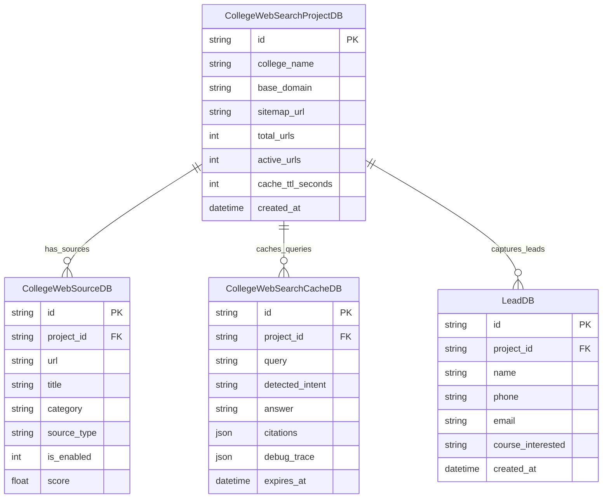

# Universal College AI Agent Platform - Technical Documentation

> **Version:** 2.0 (BETA)  
> **Architecture:** Full-Stack WebRTC + REST API + Grounded Live Sitemap Search  
> **Tech Stack:** Next.js 14 (App Router), TypeScript, Tailwind CSS, FastAPI (Python 3.11), SQLite/SQLAlchemy, OpenAI Realtime GA (WebRTC) & GPT-4o-Mini.

---

## 1. System Overview & Architecture

The **Universal College AI Agent Platform** is an enterprise-grade academic assistant designed for colleges and universities. It allows prospective students, parents, and current students to inquire about admissions, courses, fees, scholarships, hostels, and placements through both **Realtime Voice (WebRTC)** and **Grounded Text Web Search**.

```
+----------------------------------------------------------------------------------------------------+
|                                      CLIENT LAYER (Next.js 14)                                     |
|  +------------------------------+  +-------------------------------+  +-------------------------+  |
|  |  College Voice Web Search    |  |   College Web Search (Text)   |  |   Embeddable Widget /   |  |
|  |  (WebRTC Realtime + Tables)  |  |   (Grounded Sitemap Retrieval)|  |   Hardcoded FAQ Bot     |  |
|  +--------------+---------------+  +---------------+---------------+  +------------+------------+  |
+-----------------|----------------------------------|-------------------------------|---------------+
                  | WebRTC / SDP                     | HTTP / REST                   | HTTP / REST
                  v                                  v                               v
+------------------------------------+   +-----------------------------------------------------------+
|    OPENAI REALTIME GA (WebRTC)     |   |                  FASTAPI BACKEND SERVICE                  |
|  - Model: gpt-realtime-mini        |   |  - Router: /api/college-voice                             |
|  - Audio: Near-field Isolation     |   |  - Router: /api/college/projects                          |
|  - Transcription: Whisper-1        |   |  - Router: /api/hardcoded & /api/leads                    |
|  - System VAD: 0.75 / 800ms        |   +-----------------------------+-----------------------------+
+-----------------+------------------+                                 |
                  |                                                    |
                  | Function Call: college_web_search                  v
                  +---------------------------------------> [ Dynamic Sitemap Decision Engine ]
                                                            - 70+ Approved Official URLs Allowlist
                                                            - Intent Router & Content Fetcher
                                                            - Table Matrix Parser ([TABLE START])
                                                            - Grounded LLM Synthesizer (gpt-4o-mini)
                                                            - 10-Minute Query Cache (SQLite)
+----------------------------------------------------------------------------------------------------+
```

---

## 2. Core Modules & Technical Specifications

### Feature 1: College Voice Web Search (Realtime WebRTC)
- **Frontend Route:** `/college-voice-search`
- **Backend Route:** `backend/app/api/routes/college_voice.py`
- **Frontend File:** `frontend/src/app/college-voice-search/page.tsx`

#### Architectural Flow:
1. **Ephemeral Token Generation**:
   - Client sends `POST /api/college-voice/session` with `project_id`, `voice`, and `language` (`en-IN` or `hi`).
   - Server mints an ephemeral client secret (`ek_...`) from OpenAI Realtime GA (`POST https://api.openai.com/v1/realtime/client_secrets`). Permanent OpenAI keys never leave the server.
2. **Direct Peer-to-Peer WebRTC Audio Handshake**:
   - Browser creates an `RTCPeerConnection` with local microphone tracks.
   - Exchanges SDP offer/answer with `https://api.openai.com/v1/realtime/calls` using the ephemeral token.
   - An RTC DataChannel (`oai-events`) is established for low-latency JSON event streaming.
3. **Noise Suppression & Single-Turn Microphone Gating**:
   - **Hardware DSP**: Echo cancellation, hardware noise suppression, auto gain control enabled via `navigator.mediaDevices.getUserMedia`.
   - **Near-Field AI Isolation**: `noise_reduction: { type: "near_field" }` isolates user speech from background fan/room noise.
   - **VAD Sensitivity**: Server VAD threshold set to `0.75` with `800ms` silence duration and `interrupt_response: false`.
   - **Mic Lock**: Browser disables the microphone track during search processing and speech output, reopening only when the turn is completely rendered on screen.
4. **Hinglish & English Domain Vocabulary Prompting**:
   - Whisper transcription engine is seeded with a comprehensive academic vocabulary prompt (`Poornima University, B.Tech, CSE, REAP, hostel fees, mess, tuition, placements, Jaipur, Hinglish`).
   - Ensures user transcriptions appear in clean Latin Romanized Hinglish rather than fragmented or incorrect scripts.
5. **Simultaneous Spoken Summary + Rich Markdown Screen Output**:
   - When the AI invokes `college_web_search`, the backend runs the grounded retrieval pipeline.
   - The UI immediately renders structured Markdown tables (tuition fees, development fees, RTU charges, hostel rates) and clickable source citation cards.
   - The audio stream delivers a short, polite 1–2 sentence spoken summary.

---

### Feature 2: College Web Search (Text Grounded Search)
- **Frontend Route:** `/college-web-search`
- **Backend Implementation:** `backend/app/api/routes/web_search.py`, `search_engine.py`, `generator.py`
- **Frontend File:** `frontend/src/app/college-web-search/page.tsx`

#### Architectural Flow:
1. **Multi-College Sitemap Allowlist**:
   - Maintains an approved registry of 70+ official pages categorized into *Admissions, Courses, Fees & Policies, Placements, Hostels, and Campus Life*.
   - Strictly domain-bound to the configured college (e.g., `poornima.org`), completely preventing hallucinations or third-party web leaks.
2. **Dynamic AI Link Selection**:
   - User query intent is categorized (*fees, eligibility, branch, placement, hostel*).
   - Candidate URLs are scored via keyword intersection and category matching.
   - LLM dynamically picks the 1–5 best candidate URLs from the candidate pool.
3. **Live Web Fetching & Matrix Parsing**:
   - Asynchronous parallel fetch (`httpx` + BeautifulSoup) parses HTML tables into structured `[TABLE START] ... [TABLE END]` tags.
4. **Grounded Answer Synthesis (`gpt-4o-mini`)**:
   - Synthesizes comprehensive answers with semester-wise fee breakdown tables, branches, and eligibility criteria.
   - Returns verified clickable source cards.
5. **Short-Term Query Cache (10-Minute TTL)**:
   - Hashes `project_id + query` in `CollegeWebSearchCacheDB`.
   - Identical queries within 10 minutes return instantly with **0 ms LLM latency and $0.00 API cost**.

---

### Feature 3: Hardcoded & FAQ Bot Engine
- **Frontend Routes:** `/hardcoded/[id]`, `/hardcoded-widget/[id]`
- **Backend Implementation:** `backend/app/api/routes/hardcoded.py`, `app/services/hardcoded/`

1. **Zero-Latency Rule & Regex Matching**:
   - Executes deterministic intent matching on local server CPU ($0.00 cost, <10ms response time).
   - Handles predefined frequent questions (e.g., *Campus Address, Helpline Numbers, Office Timings, Bank Account Details*).
2. **LLM Fallback Integration**:
   - For unstructured questions outside the hardcoded decision tree, gracefully routes to `SafeLLMProvider` (`gpt-4o-mini`).

---

### Feature 4: Embeddable Widgets & Multi-College Project Management
- **Frontend Routes:** `/widget/[id]`, `/poornima`, `/xyz-college`
- **Backend Implementation:** `backend/app/api/routes/widget.py`, `app/api/routes/leads.py`

1. **Lightweight Embeddable Iframe / Script**:
   - Clean floating bubble and full-screen widget modes embeddable onto any college portal via simple HTML script tags.
2. **Lead Capture Engine**:
   - Interactively collects student details (*Name, Mobile Number, Email, Interested Course, City*) and persists records to `LeadDB` with automated validation.

---

## 3. Database Schema (SQLite / SQLAlchemy)



---

## 4. API Endpoints Reference

### College Voice Web Search
| Method | Endpoint | Description |
| :--- | :--- | :--- |
| `POST` | `/api/college-voice/session` | Mints ephemeral OpenAI Realtime WebRTC session token. |
| `POST` | `/api/college-voice/search-tool` | Executes live grounded search engine & synthesizes markdown tables. |

### College Web Search (Text)
| Method | Endpoint | Description |
| :--- | :--- | :--- |
| `GET` | `/api/college/projects` | Lists all configured college projects. |
| `POST` | `/api/college/projects` | Creates a new college project and auto-ingests its sitemap. |
| `POST` | `/api/college/projects/{id}/chat` | Executes live grounded search query inference with citations & debug trace. |
| `GET` | `/api/college/projects/{id}/sources` | Lists approved allowlist URLs with category filtering. |
| `POST` | `/api/college/projects/{id}/rebuild` | Diff-checks live sitemap and updates approved sources. |

### Hardcoded FAQs & Leads
| Method | Endpoint | Description |
| :--- | :--- | :--- |
| `POST` | `/api/hardcoded/{id}/chat` | Fast rule-based FAQ match with LLM fallback. |
| `POST` | `/api/leads` | Stores prospective student lead information. |

---

## 5. API Costing & Resource Consumption

| Feature | Model(s) | Cost Per Query / Turn | Cost in INR (Approx) |
| :--- | :--- | :--- | :--- |
| **Voice Search** | `gpt-realtime-mini` + `whisper-1` + `gpt-4o-mini` | ~$0.008 – $0.02 / min | ₹0.70 – ₹1.70 / min |
| **Text Web Search** | `gpt-4o-mini` (with 10-min Cache) | ~$0.0004 – $0.0008 / query | ₹0.03 – ₹0.07 / query |
| **Hardcoded Bot** | Local Regex + `gpt-4o-mini` Fallback | $0.00 (Rule Match) / ~$0.0002 | ₹0.00 / ₹0.015 |
| **Widget Chat** | `gpt-4o-mini` | ~$0.0003 / chat | ₹0.025 |

---

## 6. VPS Production Deployment & Operations

### Prerequisites:
- Ubuntu 22.04 LTS / Debian
- Node.js 18+ & NPM
- Python 3.11+ & Virtualenv
- PM2 Process Manager (`npm install -g pm2`)
- Nginx Web Server

### Standard Deployment Script:
```bash
# 1. Navigate to project root & sync repository
cd /var/www/xyz-ai-agent
git fetch origin
git reset --hard origin/main
git pull origin main

# 2. Update Python Virtualenv & Dependencies
source venv/bin/activate
pip install -r backend/requirements.txt

# 3. Build Optimized Next.js Frontend
cd /var/www/xyz-ai-agent/frontend
npm install --production=false
npm run build
chmod -R 755 .next

# 4. Restart Background Processes with Updated Environment
cd /var/www/xyz-ai-agent
pm2 restart all --update-env
```
